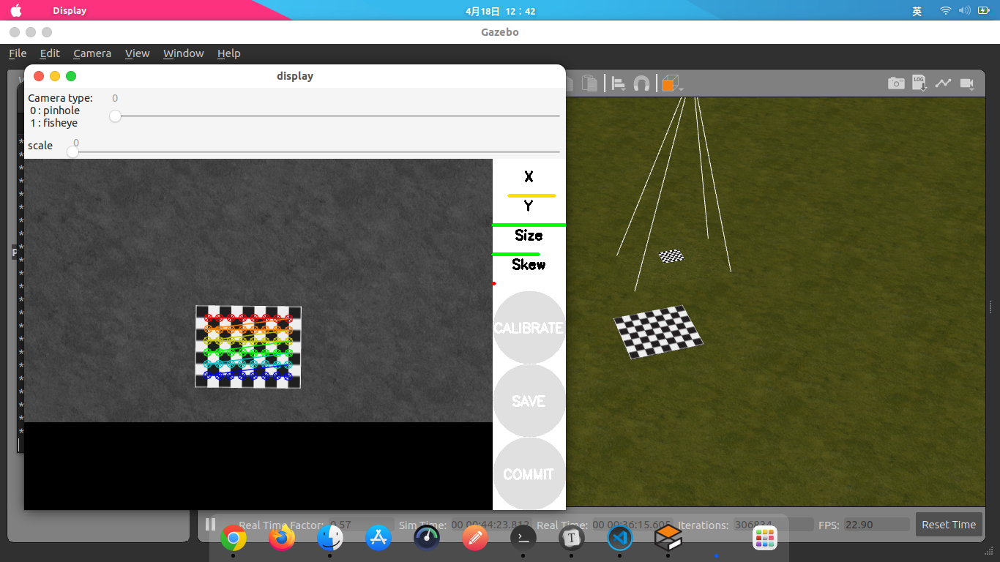

# 识别位姿自主降落(四旋翼无人机)

该算法包基于Ubuntu20.04 ROS Noetic下运行，输出相机位姿数据，寻找降落目标，实现无人机的自主降落，[演示视频](https://www.bilibili.com/video/BV1hB4y1A75t)。

该包分为三部分：

1. 普通电脑Ubuntu运行相机识别算法
2. 电脑Ubuntu运行Gazebo仿真，实现无人机识别降落目标并自主降落。
3. 真实实验实现无人机自主降落

## 硬件参数

1. 相机：[锐尔威视](http://www.rervision.cn/featured_products.html)，帧率：260FPS，像素：640*360
2. 标记点图片：

3. 四旋翼无人机（真实飞行实验）：[DJI F450](https://www.dji.com/cn/flame-wheel-arf/feature)机架、[Pixhawk2 Hex Cube](https://docs.px4.io/v1.9.0/en/flight_controller/pixhawk-2.html)飞控
4. 板载计算机（真实飞行实验）：[Nanopi M4](http://wiki.friendlyarm.com/wiki/index.php/NanoPi_M4/zh)（FridenlyDesktop LUbuntu18.04）
5. 无人机定位设备（真实飞行实验）：[OpTitrack](http://optitrack.com.cn/)

---

## 安装过程

安装过程分为3个部分，每个部分有，其中无人机部分仿真可以不用任何硬件设备。

---

### 1.普通电脑运行相机识别算法

1. 安装[Ros](http://wiki.ros.org/noetic/Installation/Ubuntu)

2. 安装g2o库依赖（优化PnP估计位姿数据）

   ~~~sh
   sudo apt-get install libsuitesparse-dev qtdeclarative5-dev qt5-qmake libqglviewer-headers
   git clone https://github.com/koide3/g2o.git
   cd g2o
   git checkout hdl_graph_slam
   mkdir build && cd build
   cmake .. -DCMAKE_BUILD_TYPE=RELEASE
   make -j8
   sudo make install
   ~~~

3. 安装Sophus库（李群与李代数，描述位姿SO3空间）

   ~~~shell
   git clone https://github.com/strasdat/Sophus.git
   cd Sophus/
   mkdir build
   cd build
   cmake ..
   make
   sudo make install
   ~~~

4. 安装uvc camera驱动

   ~~~shell
   sudo apt install libuvc-dev
   ~~~

5. 创建工作空间，下载源码

   ~~~sh
   cd ~/
   mkdir -p ~/quadrotor_ws/src
   cd ~/quadrotor_ws/src
   git clone
   ~~~

6. 编译libuvc_ros，并修改相机串口号

   - 编译：

     ~~~sh
     # Noetic安装python3的catkin编译工具
     sudo apt install python3-catkin-tools python3-osrf-pycommon
     catkin build libuvc_ros
     ~~~

   - 设置相机串口：

     ~~~shell
     lsusb
     # Bus 004 Device 050: ID 32e4:4689
     ~~~

     其中Vendor号为0x32e4，Product号为4689，如果要运行自己的相机需要修改成自己相机的ID号

     编辑/etc/udev/rules.d/99-uvc.rules文件

     ~~~shell
   sudo gedit /etc/udev/rules.d/99-uvc.rules
     ~~~
     
     ~~~txt
     # UVC cameras
     SUBSYSTEMS=="usb", ENV{DEVTYPE}=="usb_device", 	ATTRS{idVendor}=="32e4", ATTRS{idProduct}=="4689", MODE="0666"
     Change the vendor and product IDs to match your camera.
   	~~~
     
     修改libuvc_ros/libuvc_camera/launch/libuvc_camera.launch
     
      ~~~
      	<param name="vendor" value="0x32e4"/>
      	<param name="product" value="0x4689"/>
      ~~~
     
     保存后，重新加载udev规则
     
      ~~~sh
      sudo udevadm control --reload-rules
      sudo udevadm trigger
      ~~~

7. 标定自己的相机参数：详见http://wiki.ros.org/camera_calibration/Tutorials/MonocularCalibration。并在~/quadrotor_ws/src/detect_points/src/detect_points.cpp替换成自己的相机参数。

8. 编译其余包

   ~~~shell
   catkin build detect_points rviz_simulation 
   ~~~

9. 运行

   ~~~shell
   # 开启相机
   roslaunch libuvc_camera libuvc_camera.launch  
   # 开启检测位姿节点
   rosrun detect_points detect_points
   # 仿真
   rosrun rviz_simulation rviz_simulation 
   rviz
   ~~~

10. 效果

   

---

### 2.运行Gazebo仿真，实现无人机识别降落目标并自主降落

1. 安装PX4固件

   - 安装依赖

     安装mavros以及相关的 geographiclib dataset

     ~~~sh
     sudo apt install ros-noetic-mavros ros-noetic-mavros-extras
     wget https://raw.githubusercontent.com/mavlink/mavros/master/mavros/scripts/install_geographiclib_datasets.sh
     chmod +x install_geographiclib_datasets.sh
     sudo ./install_geographiclib_datasets.sh
     ~~~

   - 下载PX4/Autopilot（已经使用了国内源，下载速度会快许多），这里把Firmware克隆至~/

     ~~~sh
     git clone https://github.com.cnpmjs.org/PX4/Firmware.git --recursive
     ~~~

   - 在下载子模块的时候速度很慢，停止。同样使用国内源，打开~/Firmware/.git/config，找到子模块下载网址，将github.com全部改为github.com.cnpmjs.org，然后继续下载。

     ~~~shell
     git submodule update --init --recursive
     ~~~

   - 下载完成后切换版本并编译px4_sitl_default

     ~~~sh
     git checkout v1.11.0-beta1
     # 完成环境配置
     source ~/Firmware/Tools/setup/ubuntu.sh 
     sudo apt install libgstreamer-plugins-base1.0-dev 
     make distclean
     make  px4_sitl_default
     ~~~

   - 编译Gazebo

     在`~/Firmware/Tools/sitl_gazebo`路径下执行:

     ~~~sh
     mkdir Build
     ### 将以下所有的[]都替换成Firmware所在的路径
     ### 设置插件的路径以便 Gazebo 能找到模型文件 
     export GAZEBO_PLUGIN_PATH=${GAZEBO_PLUGIN_PATH}:~/Firmware/Tools/sitl_gazebo/Build
     ### 设置模型路径以便 Gazebo 能找到机型 
     export GAZEBO_MODEL_PATH=${GAZEBO_MODEL_PATH}:~/Firmware/Tools/sitl_gazebo/models
     ### 禁用在线模型查找 
     export GAZEBO_MODEL_DATABASE_URI="" 
     ### 设置 sitl_gazebo 文件夹的路径 
     export SITL_GAZEBO_PATH=~/Firmware/Tools/sitl_gazebo
     ### 编译gazebo仿真
     cd Build
     cmake ..
     make
     ~~~

   - 启动仿真

     ~~~sh
     cd ~/Firmware
     make px4_sitl_default
     source ~/Firmware/Tools/setup_gazebo.bash ~/Firmware ~/Firmware/build/px4_sitl_default
     export ROS_PACKAGE_PATH=$ROS_PACKAGE_PATH:~/Firmware
     export ROS_PACKAGE_PATH=$ROS_PACKAGE_PATH:~/Firmware/Tools/sitl_gazebo
     roslaunch px4 mavros_posix_sitl.launch 
     ~~~

     为了方便在~/.bashrc中添加环境变量

     ~~~sh
     source ~/Firmware/Tools/setup_gazebo.bash ~/Firmware ~/Firmware/build/px4_sitl_default
     export ROS_PACKAGE_PATH=$ROS_PACKAGE_PATH:~/Firmware
     export ROS_PACKAGE_PATH=$ROS_PACKAGE_PATH:~/Firmware/Tools/sitl_gazebo
     ~~~

2. 将地标图片和环境导入至Gazebo中

   - 将models文件夹下的全部文件全部复制到`~/.gazebo/medels/`中

   - 将world/land文件复制至`/home/jh/Firmware/Tools/sitl_gazebo/worlds`

   - 修改`~/Firmware/launch/mavros_posix_sitl.launch`文件

     ~~~txt
     # 在14行下面增加一句：
     <arg name="cam" default="iris_fpv_cam"/>
     
     # 注释原文件该行
     # <arg name="world" default="$(find mavlink_sitl_gazebo)/worlds/empty.world"/>
     # 替换成该行
     <arg name="world" default="$(find mavlink_sitl_gazebo)/worlds/land"/>
     
     # 注释原文件该行
     # <arg name="sdf" default="$(find mavlink_sitl_gazebo)/models/$(arg vehicle)/$(arg vehicle).sdf"/>
     # 替换成该行
     <arg name="sdf" default="$(find mavlink_sitl_gazebo)/models/$(arg cam)/$(arg cam).sdf"/>
     ~~~

   - 修改fpv camera摄像头朝向

     默认情况下摄像头朝向正前方，修改为正视向下。

     打开`~/Firmware/Tools/sitl_gazebo/models/iris_fpv_cam/iris_fpv_cam.sdf`修改pose

     ~~~
     <pose>0 0 0 0 1.57 0</pose>
     ~~~

3. 标定仿真相机

   - 由于iris_fpv_cam相机的内参矩阵没有，需要自行标定。model文件夹下的pattern为标定棋盘的sdf模型，将文件world/calibration复制到~/Firmware/Tools/sitl_gazebo/worlds下。修改~/Firmware/launch/mavros_posix_sitl.launch的第14行，将world改为calibration（即刚复制的文件名）。

   - 编译运行节点offboard：

     ~~~sh
     catkin build offboard
     ~~~

   - 修改~/quadrotor_ws/src/offboard/src/offboard_node.cpp，让无人机携带相机能运动，见文件76-91行的注释部分，取消注释后再次，编译即可让无人机循环飞行。

   - 运行标定节点。Gazebo中标定棋盘模型为0.7m*0.9m，尺寸已设定好，可自行调整。

     ~~~sh
     rosrun camera_calibration cameracalibrator.py --size 8x6 --square 0.1 image:=/iris/usb_cam/image_raw camera:=/iris/usb_cam/
     ~~~

     采集40个样本数据即可完成标定，若循环飞行无法采集足够的标定样本的图片，可自行调整offboard_node.cpp文件中的循环飞行程序。

     

   - 采集40个标定样本图片后点击CALIBRATE，终端显示标定结果，点击COMMIT保存标定结果，在~/.ros/camera_info/usb_cam.yaml。

     ~~~yaml
     image_width: 640
     image_height: 360
     camera_name: usb_cam
     camera_matrix:
       rows: 3
       cols: 3
       data: [544.880237599894, 0, 320.4663122316785, 0, 544.6874226929398, 180.8884597637828, 0, 0, 1]
     distortion_model: plumb_bob
     distortion_coefficients:
       rows: 1
       cols: 5
       data: [0.0003391892158313982, -0.001901180800201906, 0.0001098464987223014, -0.0001676697397938901, 0]
     rectification_matrix:
       rows: 3
       cols: 3
       data: [1, 0, 0, 0, 1, 0, 0, 0, 1]
     projection_matrix:
       rows: 3
       cols: 4
       data: [543.976806640625, 0, 319.870391180244, 0, 0, 543.229248046875, 180.4125712442474, 0, 0, 0, 1, 0]
     ~~~

     注：每个人电脑的标定结果可能不一样，需要适应于自己电脑的的iris_fpv_cam，本程序已经修改了~/Firmware/Tools/sitl_gazebo/models/iris_fpv_cam/iris_fpv_cam.sdf。后续计算位置姿态需要用到内参矩阵与失真系数。

   4. 编译运行auto_land。

      在编译之前需要将相机内参修改为自己系统PX4仿真iris_fpv_cam的内参矩阵与失真系数，即将之前标定结果~/.ros/camera_info/usb_cam.yaml的camera_matrix和distortion_coefficients替换至~/quadrotor_ws/src/detect_points/src/detect_points.cpp中。

      打开~/quadrotor_ws/src/detect_points/src/detect_points.cpp的14行与22行。

      ~~~cpp
      double camD[9] = {
      		544.880238, 0.000000, 320.466312,
      		0.000000, 544.687423, 180.888460, 
      		0.000000, 0.000000, 1.000000};
      		
      double distCoeffD[5] = {0.000339, -0.001901, 0.000110, -0.000168, 0.000000};
      ~~~

      正式编译

      ~~~sh
      catkin build auto_land
      ~~~

   5. 运行Gazebo仿真自主降落程序：

      ~~~sh
      roslaunch px4 mavros_posix_sitl.launch
      rqt
      rosrun detect_points detect_points
      rosrun auto_land auto_land
      rosrun rviz_simulation rviz_simulation
      rviz
      ~~~

      其中在rqt中添加两个Plugins/Visualization/Image View，选择对应的话题即可查看图像。在rviz需要添加tf，将frame_id选择world。

      

---

### 3.真实飞行实验实现无人机自主降落

在真实飞行实验中采用的是Optitrack定位，设备较贵，用于外部提供位姿数据，也可用视觉里程计VIO，若没有自身的数据PX4无法开启Offboard模式飞行，[PX4官方运动捕捉系统介绍](http://docs.px4.io/master/zh/ros/external_position_estimation.html)。共需要Windows和Linux的电脑各一台，同时需要连接同一WiFi，处于同一局域网中，Linux接收来自Optitrack的数据，同时远程控制无人机的板载机NanoPi。

1. Optitrack设置

   使用已经标定好的Optitrack，在无人机贴上四个（或者更多）不共平面的标记点后建立刚体，开启局域网广播，[使用教程](https://blog.csdn.net/weixin_41536025/article/details/89913961)，其中需要将坐标系调整成Z UP。在Ubuntu中，使用vrpn_client_ros来订阅数据。

   Windows的Optitrack Motive

   

   Ubuntu ROS vrpn_client_ros

   ~~~sh
   catkin build vrpn_client_ros
   source devel/setup.bash
   roslaunch vrpn_client_ros sample.launch server:=IP
   ~~~

   其中IP为Windows局域网的IP地址

   

2. 树莓派设置

   要在树莓派安装ROS环境、mavros、与install_geographiclib_datasets.sh

   - 安装[Ros](http://wiki.ros.org/noetic/Installation/Ubuntu)

   - 安装mavros与geographiclib

     ~~~sh
     sudo apt install ros-noetic-mavros ros-noetic-mavros-extras
     wget https://raw.githubusercontent.com/mavlink/mavros/master/mavros/scripts/install_geographiclib_datasets.sh
     chmod +x install_geographiclib_datasets.sh
     sudo ./install_geographiclib_datasets.sh
     ~~~
   
3. 远程登录运行

   Windows、Ubuntu、树莓派要连接同一局域网，数据流传输：

   

   - Ubuntu远程登录树莓派

     ~~~
     ssh pi@192.168.1.195
     ~~~

     其中前面为树莓派的用户名，后面为IP地址。

   - 开启VRPN，订阅位姿数据。

     ~~~sh
     roslaunch vrpn_client_ros sample.launch server:=192.168.1.116
     ~~~

     其中server后的IP为Windows motive的IP地址。可以查看位姿数据，使用rostopic echo查看。
     
   - 运行mavros，地面站QGC，转换位姿数据重新映射，PX4要通过USB连接板载机。
   
     ~~~sh
     sudo chmod 777 /devttyACM0
     roslaunch mavros px4.launch fcu_url:=/dev/ttyACM0:921600 gcs_url:=udp://@192.168.1.34:14550
     ~~~
   
     其中gcs_url的IP为运行QGC的Ubuntu电脑IP。
   
     设置QGC一些参数，[参考](https://docs.px4.io/master/en/companion_computer/pixhawk_companion.html)：
   
     设置板载机连接数据传输：
   
     - MAV_1_CONFIG = TELEM 2
     - MAV_1_MODE = Onboard
     - SER_TEL2_BAUD = 921600
   
     设置EKF2，即使用位姿数据来源
   
     - EKF2_AID_MASK设置为 vision yaw fusion和vision position fusion
     - EKF2_HGT_MODE 设置为VISION 
   
     设置USB安全解锁，即PX4通过USB连接PX4同样也能解锁。
   
     - CBRK_SUPPLY_CHK设置为894281
   
     映射位姿数据：
   
     ~~~sh
     rosrun topic_tools relay /vrpn_client_node/<rigid_body_name>/pose /mavros/vision_pose/pose
     ~~~
   
     PX4解锁，运行offboard模式并自主降落。
     
     ~~~sh
   rosrun auto_land auto_land
     ~~~
   
     
   
     
   
     
   
     
     
     

  

​     

 

   